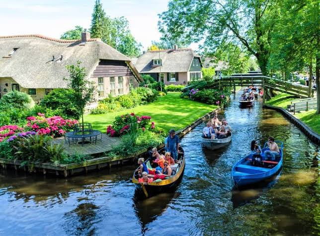

## Dutch Venice

This is a picture of the beautiful village Giethoorn, located in the North of the Netherlands

{fig-align="center"}

```{r}
#creating fictive tourism dataset

giethoorn<- data.frame(month= factor(c("jan", "feb", "mar", "apr", "may", "jun", "jul", "aug", "sep", "oct", "nov", "dec"), levels=c("jan", "feb", "mar", "apr", "may", "jun", "jul", "aug", "sep", "oct", "nov", "dec")), tourists= c(20876, 18367, 38890, 67123, 90899, 113456, 201456, 203444, 101895, 50890, 29432, 30000)) 
```

## Tourists love Giethoorn

This is a visual representation of a fictive dataset of the amount of tourists in Giethoorn throughout the year

```{r}
# interactive table
library(DT)
datatable(giethoorn,
          options = list(pagelength = 6,   # half a year is shown
                         scrollX = TRUE,
                         autoWidth = TRUE),
          rownames = FALSE) 

```

## Tourist trend throughout the year

Interactive figure displaying the amount of tourists in Giethoorn throughout the year

```{r}
library(ggplot2)
library(plotly)

plot<- ggplot(giethoorn, aes(x=month, y=tourists, group = 1)) + geom_point(size = 2) + geom_line(color="purple") + labs(
  x = "Month of the year",
  y = "Amount of tourists"
) + theme_minimal()

ggplotly(plot)
```

## Another visual representation of amount of tourists throughout the year

```{r}
#| echo: false
#| 
ggplot(giethoorn, aes(x=month, y=tourists, group=1)) + geom_col(fill="cyan")
```

## High season

::::: columns
::: {.column width="40%"}
There is a noticeable trend during warmer months, especially in summer. This is high season in Giethoorn, and it is infamous for the canals and boats.
:::

::: {.column width="60%"}
The canals get very full and there are a lot of collisions {fig-align="right"}
:::
:::::

## Predicting amount of tourists

Considering the weather, the amount of boats rented on a day in Giethoorn can be predicted using the following formula:

\begin{array}{rl}
warm weather - rainfall = boats rented x 100
\\ W + R = B \\ \hline
0.7(W) - 0.5(R) = B \\ \hline
17.5 - 0 = 17.5
\end{array}

\

So, a day with 25 degrees celsius and no hours of rainfall will likely result in about 1750 boats rented on one day. Ofcourse, there are other variables to consider in this prediction too.

## Example of rainy day

```{r}
#| echo: true
#| eval: false

0.7*15 - 0.5*10
```

Only considering the weather, 550 boats are expected to be rented on this day.

## Example of rainy day 2

As Giethoorn is in the Netherlands, we can also expect some rainy and cold days. Image a day where it is 5 degrees celsius and rains the entire 24 hours. Applying the weather formula this is what we get:

```{r}
#| cache: true
#| code-line-numbers: true
#| label: extremely cold and rainy day

0.7*5 - 0.5*24
```

This results in a predicted boat rental of -850....As mentioned before, it is also important to consider confounders in this relationship

## Confounder literature

This is an article explains statistically controlling for confounders and introduces DAGS: a way to visually display causal relationships.

[@rohrer2018]

This can be useful in optimising the boat rental formula, also considering other variables.

## A renv reproducible environment

```{r}
#| echo: true

library(renv)
renv::init()
```

# References
